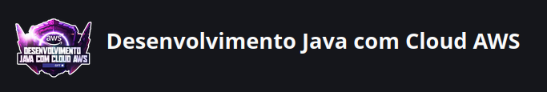

# Dio-Desenvolvimento-Java-AWS

# Bem-vindo ao meu repositório do Projeto Desenvolvimento Java com Cloud AWS - Digital Innovation one

Seja muito bem-vindo ao meu epositório do curso de Desenvolvimento Java com Cloud AWS, oferecido pela Dio - Digital Innovation one

## Sobre o Projeto
Neste repositório deixarei minhas experiencias nessa jornada e espero por sua contribuição, seja com criticas e sujestões! 

## Como Contribuir

Sua contribuição é muito bem-vinda! Se você um novo programador ou um veterano experiente, há espaço para todos aqui. Aqui estão algumas maneiras pelas quais você pode contribuir:

- **Adicione Recursos:** Se você encontrar um tutorial, artigo ou recurso útil relacionado ao curso, sinta-se à vontade para compartilhá-lo.
- **Compartilhe Experiências:** Compartilhe seus conhecimentos e experiências . Discutir desafios e soluções pode ser incrivelmente enriquecedor para todos os envolvidos.

## Como Começar

1. **Clone o Repositório:** Comece clonando este repositório em sua máquina local usando o comando: `git clone https://github.com/WandeilsonFerreira/Dio-Desenvolvimento-Java-AWS.git`.
2. **Ambiente de Desenvolvimento:** Configure seu ambiente de desenvolvimento. Certifique-se de ter a linguagem e as ferramentas necessárias instaladas.
3. **Explore e Contribua:** Explore os arquivos, leia a documentação e comece a contribuir! Sinta-se à vontade para criar problemas (issues), enviar solicitações de recebimento (pull requests) e participar das discussões.

Agradeço por se juntar nesta jornada de aprendizado e criação.  

Divirta-se programando!

